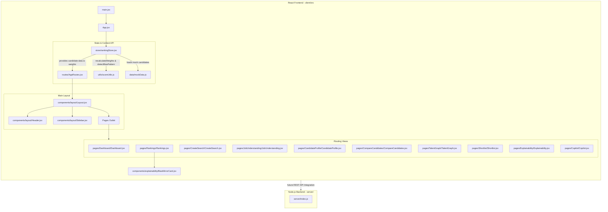
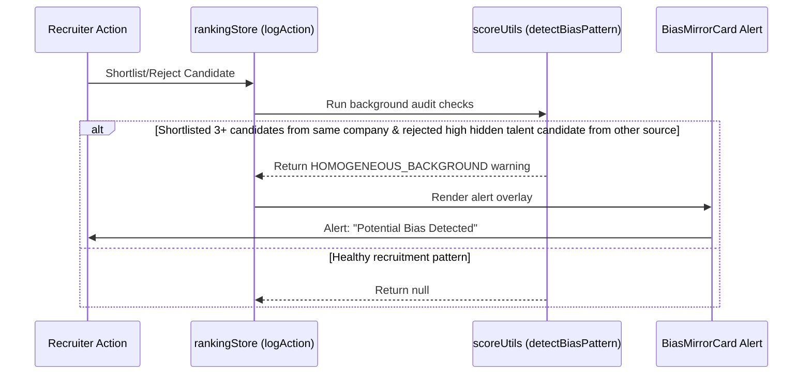

# TalentRank AI — Codebase Analysis & Architecture Documentation

TalentRank AI is an AI-powered talent acquisition platform that goes beyond standard resume keyword filtering. It evaluates candidates through semantic skill alignment, career progression analysis, activity signals, learning velocity, and hidden talent indicators, with dynamic weight recalculation and automated bias monitoring.

---

## 🏗️ High-Level System Architecture

The application is built on a decoupled Client-Server architecture:
*   **Frontend (React/Vite)**: An interactive single-page application styled using Tailwind CSS v4 and Framer Motion. State management is handled through a custom React Context state provider. Visual graphics and data charts are rendered using Recharts, and the relationships are drawn in an interactive network view using SVG with Framer Motion drag mechanics.
*   **Backend (Node.js/Express)**: A lightweight REST API server layer built with Express that serves as the entry point for backend services (mocked on the frontend in the current setup, but scaffolding is ready for database and model integrations).

### Component Relationships & Data Flow Diagram



---

## 📂 Project Directory Structure

```bash
India-Runs-Project/
├── client/                      # React Frontend application
│   ├── public/                  # Static browser assets (icons, favicons)
│   ├── src/                     # Frontend source files
│   │   ├── assets/              # Static media files (logos, illustrations)
│   │   ├── components/          # Reusable component parts
│   │   │   ├── layout/          # Page layout shells (Header, Sidebar)
│   │   │   └── explainability/  # Explainability and warning modules
│   │   ├── data/                # Hardcoded data definitions
│   │   ├── pages/               # Routing page components
│   │   ├── routes/              # Routing configurations
│   │   ├── store/               # Global state provider
│   │   ├── styles/              # Global variable styles
│   │   └── utils/               # Constants and arithmetic utilities
│   ├── eslint.config.js         # Linting guidelines
│   ├── index.html               # Frontend HTML root entry
│   ├── package.json             # Frontend package configurations
│   └── vite.config.js           # Vite server bundler configurations
├── server/                      # Express API Backend application
│   ├── index.js                 # API server initialization script
│   └── package.json             # Server package configurations
└── readme.md                    # Platform product specifications documentation
```

---

## 📄 File-by-File Analysis

### 1. Root Configuration & Documentation Files
*   **[readme.md](file:///Users/pawaneswaran/Desktop/Work/HACKATHONS/India%20Runs/India-Runs-Project/readme.md)**: Product specification guide highlighting the platform's vision, modules (Job Understanding, Candidate Intelligence, Semantic Matching, Ranking, Explainability), system flows, and recommended tech stack.

### 2. Frontend Configuration & Entry Files
*   **[client/package.json](file:///Users/pawaneswaran/Desktop/Work/HACKATHONS/India%20Runs/India-Runs-Project/client/package.json)**: Declares frontend configuration and script runners. Dependencies include React 19, Tailwind CSS v4 (`@tailwindcss/vite` and `tailwindcss`), Framer Motion (animations), Recharts (data plotting), React Router v7, and Lucide React (icon assets).
*   **[client/vite.config.js](file:///Users/pawaneswaran/Desktop/Work/HACKATHONS/India%20Runs/India-Runs-Project/client/vite.config.js)**: Configures Vite compiler parameters, importing React, Tailwind, and Babel compilation presets.
*   **[client/eslint.config.js](file:///Users/pawaneswaran/Desktop/Work/HACKATHONS/India%20Runs/India-Runs-Project/client/eslint.config.js)**: Specifies lint rules to assert JavaScript syntax and React hook standards.
*   **[client/index.html](file:///Users/pawaneswaran/Desktop/Work/HACKATHONS/India%20Runs/India-Runs-Project/client/index.html)**: Main HTML structure containing the mounting target (`#root`) and loading `/src/main.jsx`.
*   **[client/src/main.jsx](file:///Users/pawaneswaran/Desktop/Work/HACKATHONS/India%20Runs/India-Runs-Project/client/src/main.jsx)**: Binds the React runtime environment to the `#root` DOM element in StrictMode.
*   **[client/src/App.jsx](file:///Users/pawaneswaran/Desktop/Work/HACKATHONS/India%20Runs/India-Runs-Project/client/src/App.jsx)**: Wraps routing views inside the global `<RankingProvider>` context to share candidate scoring state and configures global layout styles.
*   **[client/src/index.css](file:///Users/pawaneswaran/Desktop/Work/HACKATHONS/India%20Runs/India-Runs-Project/client/src/index.css)**: Implements Tailwind CSS imports and defines base styles, custom webkit scrollbar rules, and custom utility classes (such as `.card-panel` and `.neon-text`).
*   **[client/src/styles/variables.css](file:///Users/pawaneswaran/Desktop/Work/HACKATHONS/India%20Runs/India-Runs-Project/client/src/styles/variables.css)**: Stores CSS custom properties defining colors like primary, background shades, borders, and text fills.

### 3. Application State & Navigation Routing
*   **[client/src/store/rankingStore.jsx](file:///Users/pawaneswaran/Desktop/Work/HACKATHONS/India%20Runs/India-Runs-Project/client/src/store/rankingStore.jsx)**: The central data engine of the application. Using React Context, it provides:
    *   `candidates`: Computes dynamic overall matches in real-time by weighing core skills, experience, behavior, and hidden talent scores against the dynamic weight vector.
    *   `shortlistColumns`: Stage records for the pipeline Kanban board (Shortlisted, Interview, Offer, Hired).
    *   `compareList`: Stores candidate IDs selected for side-by-side comparison.
    *   `logAction`: Records recruiter actions (e.g. Shortlist, Reject), triggers real-time weight recalculations, and checks for demographic or company background biases.
*   **[client/src/routes/AppRoutes.jsx](file:///Users/pawaneswaran/Desktop/Work/HACKATHONS/India%20Runs/India-Runs-Project/client/src/routes/AppRoutes.jsx)**: Declares routing paths (`/dashboard`, `/create-search`, `/job-understanding`, `/rankings`, `/candidate/:id`, `/compare`, `/talent-graph`, `/shortlist`, `/explainability`, `/copilot`) nested within the shared structure of the main Layout.

### 4. Layout & Global Components
*   **[client/src/components/layout/Layout.jsx](file:///Users/pawaneswaran/Desktop/Work/HACKATHONS/India%20Runs/India-Runs-Project/client/src/components/layout/Layout.jsx)**: The app skeleton component that renders the `Sidebar` navigation, the top `Header` component, and a nested `<Outlet />` element to display page routes.
*   **[client/src/components/layout/Header.jsx](file:///Users/pawaneswaran/Desktop/Work/HACKATHONS/India%20Runs/India-Runs-Project/client/src/components/layout/Header.jsx)**: Displays a search input field, notification center flags, and user profile management controls.
*   **[client/src/components/layout/Sidebar.jsx](file:///Users/pawaneswaran/Desktop/Work/HACKATHONS/India%20Runs/India-Runs-Project/client/src/components/layout/Sidebar.jsx)**: Sidebar component providing instant navigation across all views, decorated with Lucide React icons.
*   **[client/src/components/explainability/BiasMirrorCard.jsx](file:///Users/pawaneswaran/Desktop/Work/HACKATHONS/India%20Runs/India-Runs-Project/client/src/components/explainability/BiasMirrorCard.jsx)**: Floating alert that renders when the system logs a homogenous company background bias pattern, offering a quick toggle to highlight overlooked talent.

### 5. Utilities & Static Data Sources
*   **[client/src/utils/constants.js](file:///Users/pawaneswaran/Desktop/Work/HACKATHONS/India%20Runs/India-Runs-Project/client/src/utils/constants.js)**: Declares standard hex configuration values matching the core application themes.
*   **[client/src/utils/scoreUtils.js](file:///Users/pawaneswaran/Desktop/Work/HACKATHONS/India%20Runs/India-Runs-Project/client/src/utils/scoreUtils.js)**: Mathematical reasoning algorithms that control system intelligence:
    *   `recalculateWeights`: Dynamically adjusts search weights (scaling up Hidden Talent weights and reducing standard parameters) if the recruiter rejects high hidden-talent candidates.
    *   `detectBiasPattern`: Audits recruiter decisions. If a user shortlists three candidates from the same company and rejects an applicant from a non-traditional background with high potential (hidden talent score $\ge 70$), it triggers a homogeneous background warning.
*   **[client/src/data/mockData.js](file:///Users/pawaneswaran/Desktop/Work/HACKATHONS/India%20Runs/India-Runs-Project/client/src/data/mockData.js)**: A simulated database of candidates with specific profile details, background tags, scoring vectors, and qualitative hidden talent summaries.

### 6. View Page Components
*   **[client/src/pages/Dashboard/Dashboard.jsx](file:///Users/pawaneswaran/Desktop/Work/HACKATHONS/India%20Runs/India-Runs-Project/client/src/pages/Dashboard/Dashboard.jsx)**: Central admin homepage that details search stats, pipelines, candidate flows (rendered with a Recharts AreaChart), source breakdown performance (PieChart), and an overlay distribution plot (ScatterChart).
*   **[client/src/pages/CreateSearch/CreateSearch.jsx](file:///Users/pawaneswaran/Desktop/Work/HACKATHONS/India%20Runs/India-Runs-Project/client/src/pages/CreateSearch/CreateSearch.jsx)**: The search initialization center. Allows uploading job descriptions, configuring filters (location, salary, tenure), and adjusting weight sliders before launching AI matching.
*   **[client/src/pages/JobUnderstanding/JobUnderstanding.jsx](file:///Users/pawaneswaran/Desktop/Work/HACKATHONS/India%20Runs/India-Runs-Project/client/src/pages/JobUnderstanding/JobUnderstanding.jsx)**: Renders AI-extracted job details, including keyword analysis, core requirement bars, and implicit "Hidden Signals" (e.g., startup mindset or leadership capabilities).
*   **[client/src/pages/Rankings/Rankings.jsx](file:///Users/pawaneswaran/Desktop/Work/HACKATHONS/India%20Runs/India-Runs-Project/client/src/pages/Rankings/Rankings.jsx)**: Displays candidates sorted by match percentage. Recruiter clicks trigger state changes, logging decisions like shortlists/rejections to check for background biases.
*   **[client/src/pages/CandidateProfile/CandidateProfile.jsx](file:///Users/pawaneswaran/Desktop/Work/HACKATHONS/India%20Runs/India-Runs-Project/client/src/pages/CandidateProfile/CandidateProfile.jsx)**: An in-depth candidate dossier showing a Recharts RadarChart of skills, interactive timeline components, red flag indicators, and AI-generated interview prompts tailored to profile weaknesses.
*   **[client/src/pages/CompareCandidates/CompareCandidates.jsx](file:///Users/pawaneswaran/Desktop/Work/HACKATHONS/India%20Runs/India-Runs-Project/client/src/pages/CompareCandidates/CompareCandidates.jsx)**: Displays side-by-side tables comparing candidate attributes (e.g., match score, leadership, hidden talent, location) and outputs a final recommendation recommendation.
*   **[client/src/pages/TalentGraph/TalentGraph.jsx](file:///Users/pawaneswaran/Desktop/Work/HACKATHONS/India%20Runs/India-Runs-Project/client/src/pages/TalentGraph/TalentGraph.jsx)**: Renders a dynamic relationship network linking jobs, candidates, and skills. Nodes are fully draggable using Framer Motion capabilities and linked via inline SVG lines.
*   **[client/src/pages/Shortlist/Shortlist.jsx](file:///Users/pawaneswaran/Desktop/Work/HACKATHONS/India%20Runs/India-Runs-Project/client/src/pages/Shortlist/Shortlist.jsx)**: A Kanban-style hiring pipeline layout. Recruiters can drag and drop candidates across stages (Shortlisted, Interview, Offer, Hired), sync states, and view details.
*   **[client/src/pages/Explainability/Explainability.jsx](file:///Users/pawaneswaran/Desktop/Work/HACKATHONS/India%20Runs/India-Runs-Project/client/src/pages/Explainability/Explainability.jsx)**: Visualizes feature influence (SHAP values) for top candidates and includes aDynamic Weight Simulator to manually fine-tune the ranking algorithm.
*   **[client/src/pages/Copilot/Copilot.jsx](file:///Users/pawaneswaran/Desktop/Work/HACKATHONS/India%20Runs/India-Runs-Project/client/src/pages/Copilot/Copilot.jsx)**: An interactive recruiter chatbot simulating prompt-based queries (e.g., "Find candidates with RAG experience" or "Who can join within 30 days?").

### 7. Backend Files (API Boilerplate)
*   **[server/package.json](file:///Users/pawaneswaran/Desktop/Work/HACKATHONS/India%20Runs/India-Runs-Project/server/package.json)**: Declares configuration properties for backend dependencies, including Express, Cors, and Dotenv.
*   **[server/index.js](file:///Users/pawaneswaran/Desktop/Work/HACKATHONS/India%20Runs/India-Runs-Project/server/index.js)**: Configures the API server port (default `5001`), registers JSON parsing middlewares, enables CORS policies, and handles startup listeners.

---

## ⚡ Core Algorithmic Workflows & Logic

### 1. Dynamic Match Scoring
The candidate match percentage is calculated dynamically based on user-configured weights:

$$\text{Score} = \text{Skills} \times w_{\text{skills}} + \text{Experience} \times w_{\text{exp}} + \text{Behavior} \times w_{\text{behavior}} + \text{Hidden Talent} \times w_{\text{hidden\_talent}}$$

This computation is handled automatically inside the React context (`rankingStore.jsx`), updating the candidate order in real-time as sliders are adjusted in the Explainability Center.

### 2. Decision Auditing (Bias Prevention)
When the recruiter performs actions (Shortlist/Reject), they are audited by `scoreUtils.js`:


