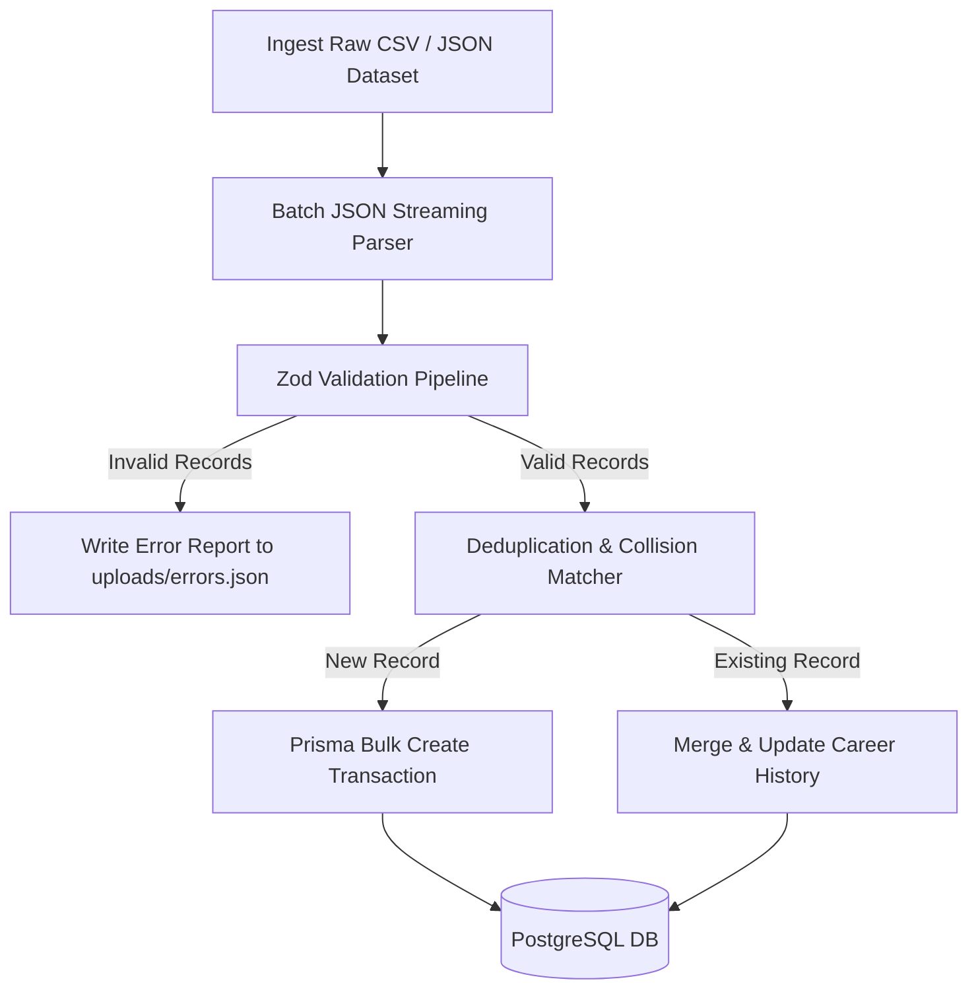

# Codebase Architecture & Dataset Integration Plan

This document serves as the guide for the TalentRank AI backend. It outlines the codebase design, file architecture, and the system blueprint for importing large talent pools.

---

## 🏗️ Folder and Layer Architecture

The server codebase is organized according to a modular, layer-oriented structure:

```bash
server/
├── prisma/                    # Database migrations and Prisma schema configurations
├── docs/                      # Architectural manuals, schematics, and API specifications
├── uploads/                   # Temporary directory for file ingestion buffers (PDF, DOCX, CSV)
├── tests/                     # Integration and automated unit test suite directories
└── src/
    ├── app.js                 # Express application initialization & middleware registration
    ├── config/                # System integrations configurations (database connection instances)
    ├── middleware/            # Custom logic hooks (error catching, authentication, logging)
    ├── modules/               # Domain-specific modules (handlers, services, route adapters)
    ├── routes/                # HTTP API route registration endpoints
    ├── utils/                 # General helpers (Winston logger wrapper, schema validation utilities)
    └── scripts/               # One-off scripts (data generation, migrations, cleanups)
```

### Layer Responsibilities:
1.  **Entry Point (`index.js`)**: Initialized by running process managers (e.g. Node/Nodemon). Bootstraps environment parameters, binds Express server to a network port, and hooks crash recovery process listeners.
2.  **App Engine (`src/app.js`)**: Builds request contexts. Configures standard safety policies (CORS), mounts HTTP serializers (body parsers), hooks logging interceptors, routes API pathways, and implements the final fallback error recovery block.
3.  **Routing (`src/routes/`)**: Registers route path patterns (e.g. `/health`) and maps request controls to validation steps.
4.  **Utilities (`src/utils/`)**: Includes the Winston logger wrapper to manage structured logs, operational error models to reject malformed parameters, and validation libraries.

---

## 📊 Dataset Integration Plan

This plan prepares the TalentRank AI backend to ingest and maintain high-volume datasets containing **100,000+ candidate profiles**.



### 1. Dataset Analysis Documentation
The ingestion target consists of massive talent pools containing demographic, professional, and activity records.

#### Data Characteristics & Formats
*   **Format**: Primarily standard tabular format (CSV) or structured JSON files.
*   **Target Size**: $100,000$ profiles, translating to:
    *   $\approx 100,000$ core Candidate records.
    *   $\approx 300,000 - 500,000$ sequential Experience records.
    *   $\approx 400,000 - 600,000$ associated Skill records.
*   **Fields**: Complete developer details including contact email, geographical coordinates, career timeline, education, certifications, and GitHub/OSS score.

#### Performance Requirements
*   **Memory Footprint**: Strict heap memory limit controls (should not load more than 50MB into memory at once). Large files must be read as streams.
*   **Database Writes**: Multi-row parameterized bulk inserts instead of serial single-row transactions to limit network overhead.
*   **Ingestion Speed**: Ingest 100k records within 5 minutes on standard PostgreSQL hardware.

---

### 2. Candidate Schema Proposal Template
Below is the draft model designed for database mapping. It structures candidates and sub-tables to enable high-throughput indexing:

```typescript
// Proposed Prisma Schema definitions
interface CandidateModel {
  id: string; // UUID primary key
  name: string;
  email: string; // Unique index
  location: string;
  currentRole?: string;
  currentCompany?: string;
  noticePeriod: number; // In days
  avatar?: string;
  hiddenTalentScore: number; // 0 to 100
  hiddenTalentFactors: string[];
}

interface ExperienceModel {
  id: string;
  candidateId: string; // FK to Candidate
  role: string;
  company: string;
  description?: string;
  year: string; // "2023 - 2025"
}

interface SkillModel {
  id: string;
  candidateId: string; // FK to Candidate
  name: string; // Indexed for search matching
  level: number;
}

interface ActivityModel {
  id: string;
  candidateId: string; // FK to Candidate
  type: 'OSS_COMMIT' | 'HACKATHON_WIN' | 'PUBLICATION';
  score: number;
  details: string;
}
```

---

### 3. Import Pipeline Design Document
Processing a 100k-candidate dataset requires streaming and batch write transactions to prevent memory exhaustion and database locking.

#### Core Pipeline Pillars:
1.  **JSON/CSV Streaming**: Rather than reading files into memory using `fs.readFile`, we use **JSONStream** or **csv-parser** streams. This processes records chunk-by-chunk using Node.js stream backpressure:
    ```javascript
    fs.createReadStream('dataset.csv')
      .pipe(csvParser())
      .on('data', (row) => { /* process row */ });
    ```
2.  **Chunking & Batching**: Rows are collected into chunks of **1,000 records** before inserting. 1,000 is the optimal batch size for PostgreSQL to minimize query compilation overhead and lock wait times:
    ```javascript
    const batchSize = 1000;
    let batchBuffer = [];
    ```
3.  **Parallel Bulk Write Queue**: Batches are processed in parallel using a concurrency queue with a limit of 5 concurrent workers. This keeps CPU usage stable and prevents connection pool starvation.
4.  **Transaction Handling**: Chunks are processed in scoped transaction blocks. If a validation error occurs inside a block, the single chunk is rejected, logged, and the pipeline continues to the next batch.

---

### 4. Deduplication Strategy Document
In a 100k dataset, duplicate profiles from different sourcing origins are common. We employ a multi-tier deduplication workflow:

#### Phase A: Direct Index Matches
*   **email**: Checked against the database. Since `Candidate.email` has a unique constraint, duplicates trigger an automatic update (upsert) instead of throwing an error.

#### Phase B: Fuzzy Correlation Matcher
If emails do not match but a candidate has similar attributes:
1.  **Standard Normalized Formats**: Convert names and roles to lowercase and strip special characters:
    *   `John-Doe` $\rightarrow$ `johndoe`
    *   `MegaData Inc.` $\rightarrow$ `megadata`
2.  **String Distance Calculations**: Use a similarity check (e.g., Levenshtein distance $\ge 85\%$) on Candidate Name, and strict matching on Current Location.
3.  **Decision Matrix**:
    *   If **Name Similarity $\ge 90\%$** AND **Location Matches** AND **Tenure Years overlap**: Flag as duplicate.
    *   If flagged as duplicate, merge details: append missing skills to the existing record and insert new experiences rather than creating a duplicate candidate profile.
