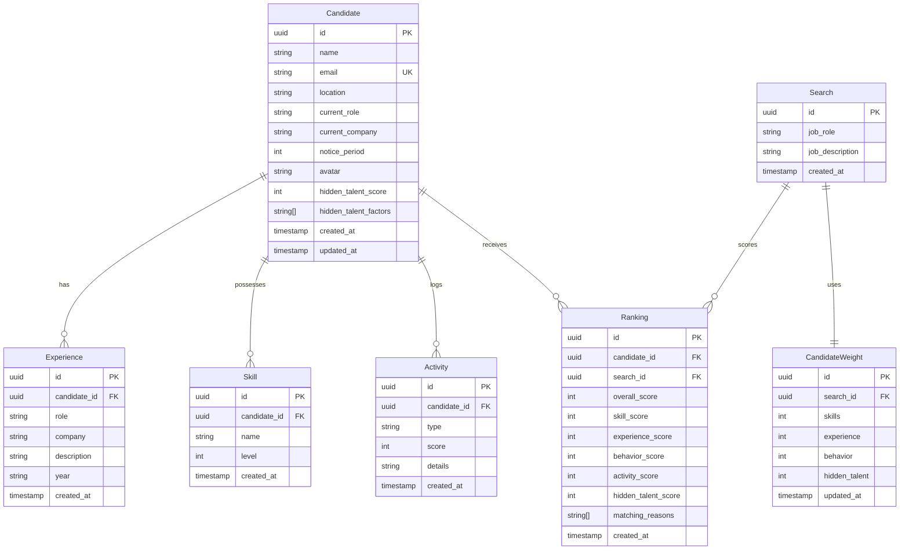

# Database Schema Blueprint - TalentRank AI

This document details the PostgreSQL relational model to store candidates, career tracks, parsed features, activities, and search weights.

---

## 🗄️ Relational Model

---

## 🗃️ Table Specifications

### 1. `Candidate`
Stores candidate profile summary details.
*   `id`: `UUID` (Primary Key, defaults to uuid_generate_v4())
*   `name`: `VARCHAR(100)` (Required)
*   `email`: `VARCHAR(255)` (Required, Unique index)
*   `location`: `VARCHAR(100)` (Required)
*   `current_role`: `VARCHAR(100)`
*   `current_company`: `VARCHAR(100)`
*   `notice_period`: `INTEGER` (Number of days)
*   `avatar`: `VARCHAR(255)` (URL)
*   `hidden_talent_score`: `INTEGER` (0 to 100)
*   `hidden_talent_factors`: `TEXT[]` (Array of qualitative factors)
*   `created_at`: `TIMESTAMP` (Defaults to NOW())
*   `updated_at`: `TIMESTAMP` (Defaults to NOW())

### 2. `Experience`
Stores work experiences for career timelines.
*   `id`: `UUID` (Primary Key)
*   `candidate_id`: `UUID` (Foreign Key referencing `Candidate.id` on delete cascade)
*   `role`: `VARCHAR(100)` (Required)
*   `company`: `VARCHAR(100)` (Required)
*   `description`: `TEXT`
*   `year`: `VARCHAR(20)` (e.g. "2023 - 2025")
*   `created_at`: `TIMESTAMP`

### 3. `Skill`
Tracks skills and dynamic capability level.
*   `id`: `UUID` (Primary Key)
*   `candidate_id`: `UUID` (Foreign Key referencing `Candidate.id` on delete cascade)
*   `name`: `VARCHAR(100)` (Required)
*   `level`: `INTEGER` (0 to 100)

### 4. `Activity`
Saves open-source and hackathon contribution markers.
*   `id`: `UUID` (Primary Key)
*   `candidate_id`: `UUID` (Foreign Key referencing `Candidate.id` on delete cascade)
*   `type`: `VARCHAR(50)` (e.g., "OSS_COMMIT", "HACKATHON_WIN")
*   `score`: `INTEGER` (Quality score weight)
*   `details`: `TEXT`

---

## ⚡ Scalability & Optimization Checklist for 100k+ Profiles

1.  **Index Strategies**:
    *   Add B-Tree index on `Candidate(email)` to support fast deduplication on ingestion.
    *   Add index on `Skill(name, level)` to speed up semantic matching queries.
    *   Composite index on `Ranking(search_id, overall_score DESC)` to allow rapid fetching of top matched results.
2.  **Cascades**:
    *   Enforce `ON DELETE CASCADE` across `Experience`, `Skill`, `Activity`, and `Ranking` tables linked to `Candidate` to prevent orphaned rows on delete.
